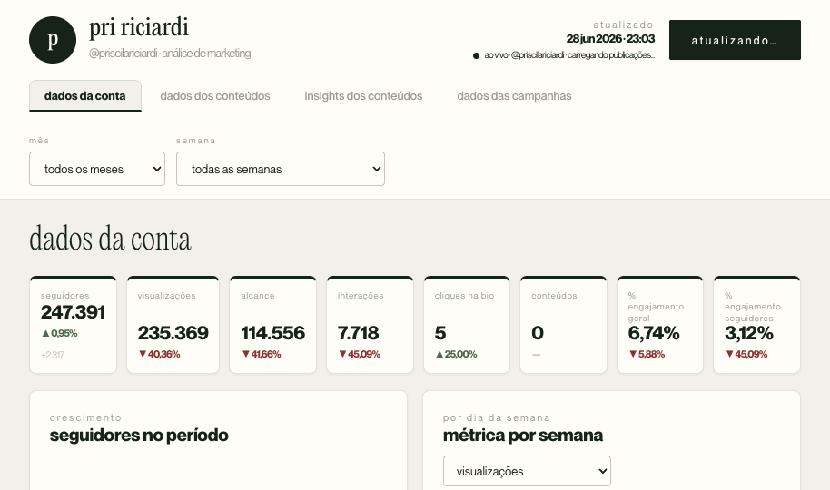

# Dashboard de Análise — Pri Riciardi

Painel de análise de performance do Instagram **@priscilariciardi** e das campanhas de tráfego (Facebook/Meta Ads) por produto, com dados servidos ao vivo pelos conectores da **Windsor.ai** e pelas planilhas de vendas (Eduzz) no Google Drive.



---

## O que é

Aplicação de **página única** que roda 100% no navegador, sem build/bundler. A interface é um único **Design Component** (`Dashboard.dc.html`) renderizado por um runtime React leve (`support.js`). Os gráficos usam **Chart.js**.

O painel tem quatro páginas:

- **Dados da conta** — KPIs do período (seguidores, visualizações, alcance, interações, cliques na bio, conteúdos, % de engajamento) + gráficos de crescimento de seguidores e métricas por dia da semana.
- **Dados dos conteúdos** — grade de cards de todas as publicações, com capa, tipo, data, métricas estilo Instagram e taxas de engajamento/salvamento/compartilhamento.
- **Insights dos conteúdos** — média por post no período, top conteúdos (métrica selecionável) e leituras de "o que funcionou / o que não funcionou" derivadas dos números.
- **Dados das campanhas** — uma aba por produto (**Woman's Academy**, **Reset Hormonal**, **Ciclo Leve**, **Essência Metabólica**) + **Novos Seguidores** e **Engajamento**. Cada produto traz a seção de **Vendas** (faturamento, nº de vendas, ticket, ROAS, custo por venda, gráficos de origem por UTM Source/Campaign/Content) e o **Investimento em tráfego pago** (funil de conversão do Facebook Ads + tabelas de anúncios e conjuntos).

---

## Como rodar

É estático — basta servir os arquivos e abrir no navegador.

```bash
# qualquer servidor estático serve; ex.:
python3 -m http.server 8000
# depois acesse http://localhost:8000/  (redireciona para Dashboard.dc.html)
```

> Abrir o arquivo direto via `file://` pode falhar por causa do carregamento de módulos/fontes — prefira um servidor estático local ou o GitHub Pages.

O painel busca os dados ao vivo na carga (Instagram + Facebook Ads pela Windsor.ai; vendas pelas planilhas do Drive). Sem rede, mostra o último estado conhecido em cache.

---

## Estrutura

```
.
├── index.html                 Redireciona para o dashboard (entrada p/ GitHub Pages)
├── Dashboard.dc.html          Aplicação — toda a UI e a lógica de dados
├── support.js                 Runtime do Design Component (React leve) — não editar
├── _ds/
│   └── l-marques-design-system-…/   Tokens de marca (cores, tipografia, fontes)
│       ├── tokens/*.css
│       ├── styles.css
│       ├── _ds_bundle.js
│       └── assets/fonts/
└── docs/
    └── ARQUITETURA.md         Referência técnica (modelo de dados, fórmulas, limitações)
```

---

## Fontes de dados

- **Instagram (Windsor.ai)** — perfil, série diária (views, alcance, interações), saldo de seguidores, demografia da audiência e publicações.
- **Facebook Ads (Windsor.ai)** — conta `10101511135973327`; campanhas cujo nome contém `WOMANS-ACADEMY`/`WA`, `RESET`, `CICLO-LEVE` e `ESSENCIA-METABOLICA`: gasto, impressões, alcance, cliques, visualizações de página e conversões, por anúncio e por conjunto.
- **Vendas (Eduzz)** — planilhas mensais públicas no Google Drive, lidas ao vivo via `gviz`. Cada venda é atribuída a um produto pelo ID Eduzz e traz status, faturamento, líquido, cupom e UTMs.

### Cache local (`localStorage`)

- **Publicações** — a 1ª carga semeia ~180 dias; as atualizações seguintes buscam só os últimos ~30 dias e mesclam com o cache. As **capas** desde janeiro/2026 são baixadas e **embutidas como imagem** (JPEG reduzido), para continuarem aparecendo mesmo após as URLs do Instagram expirarem.
- **Vendas** — histórico (mai/2025 em diante) fica em cache (`priSales:v6`); o mês corrente é sempre revalidado ao vivo.
- O app limpa automaticamente versões antigas de cache na carga, para não estourar a quota do navegador.

---

## Stack

HTML + React 18 (via runtime do Design Component) + Chart.js. Sem JSX, sem bundler, sem dependências de build.
